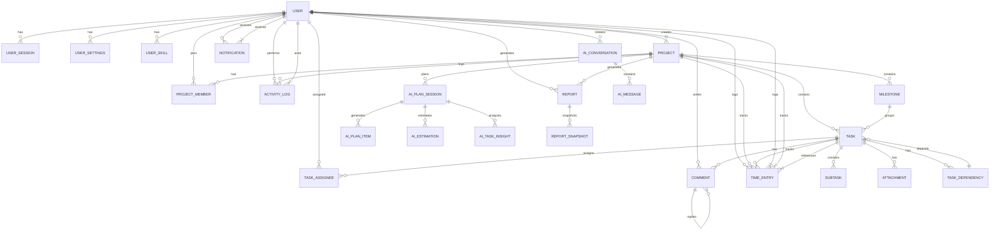

# Entity Relationship Diagram (ERD)

## Project Management System Database Schema

## Entity Categories

### User Management (5 entities)

- **USER**: Core user information with authentication, profile, availability
- **USER_SESSION**: Session management for authenticated users
- **USER_SETTINGS**: User preferences and settings
- **USER_SKILL**: User skills and expertise tracking
- **NOTIFICATION**: User notifications for various events

### Project Management (3 entities)

- **PROJECT**: Project details, status, priority, type, and mode
- **PROJECT_MEMBER**: Association between users and projects with roles
- **MILESTONE**: Project milestones with status and target dates

### Task Management (6 entities)

- **TASK**: Core task information with type, status, priority, estimates
- **SUBTASK**: Smaller work items within a task
- **TASK_ASSIGNEE**: Assignment of users to tasks (many-to-many)
- **COMMENT**: Comments on tasks with threading support
- **ATTACHMENT**: File attachments for tasks
- **TASK_DEPENDENCY**: Task dependencies and blocking relationships

### Analytics & Reporting (5 entities)

- **TIME_ENTRY**: Time tracking entries linked to tasks/projects
- **ACTIVITY_LOG**: Audit trail of user actions across the system
- **REPORT**: Generated reports with various types and formats
- **REPORT_SNAPSHOT**: Metrics and data captured in reports
- **AI_PLAN_SESSION**: AI-generated project plans and recommendations

### AI Features (5 entities)

- **AI_CONVERSATION**: Conversation sessions between users and AI
- **AI_MESSAGE**: Individual messages in conversations with roles
- **AI_PLAN_SESSION**: AI-assisted project planning sessions
- **AI_PLAN_ITEM**: Individual items in AI-generated plans
- **AI_ESTIMATION**: AI-generated task estimations
- **AI_TASK_INSIGHT**: AI insights about specific tasks

## Key Relationships

### User-Centric Relationships

- Users create projects and manage their lifecycle
- Users are project members with specific roles
- Users are assigned to tasks
- Users log time entries for tracking
- Users receive notifications and activity logs

### Project Hierarchy

- Projects contain milestones
- Milestones group tasks
- Tasks contain subtasks for granular work breakdown
- Tasks can have dependencies on other tasks

### Task Collaboration

- Tasks have multiple assignees
- Tasks can have comments with threaded replies
- Tasks can have multiple attachments
- Multiple time entries can be logged against a task

### Analytics & AI

- AI plans are generated for projects
- Time entries enable project tracking and reporting
- Activity logs provide audit trails
- Reports aggregate project metrics and snapshots

## Relationship Types

- **One-to-Many** (||--o{): One entity can relate to many of another
- **Many-to-One** (}|--||): Multiple entities relate to one entity
- **Self-Referencing**: Comments can be replies to other comments
