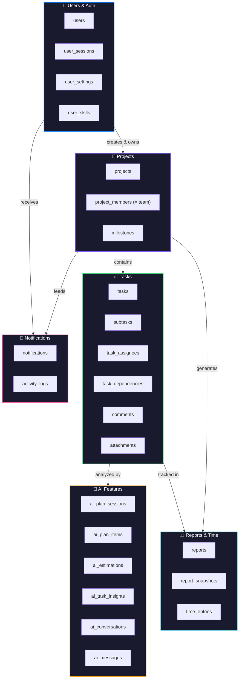
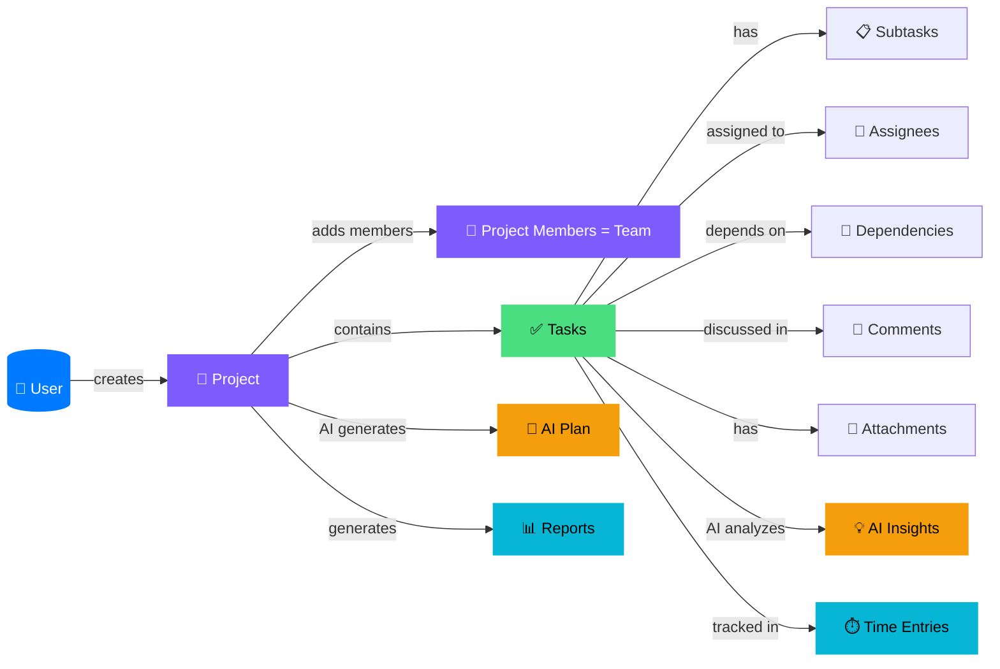

# 🗄️ Orchest — Database ERD (PostgreSQL)

> Full Entity Relationship Diagram for the **Orchest AI-Powered Project Management Platform**
> Database: **PostgreSQL** | Architecture: **User-Owned Projects (members = team)**

---

## Entity Relationship Diagram

```mermaid
erDiagram
    %% ═══════════════════════════════════════════
    %% DOMAIN 1: USERS & AUTH
    %% ═══════════════════════════════════════════

    users ||--o{ user_sessions : "has"
    users ||--|| user_settings : "configures"
    users ||--o{ user_skills : "possesses"
    users ||--o{ projects : "creates"
    users ||--o{ project_members : "participates in"
    users ||--o{ task_assignees : "assigned to"
    users ||--o{ comments : "writes"
    users ||--o{ notifications : "receives"
    users ||--o{ activity_logs : "generates"
    users ||--o{ time_entries : "logs"
    users ||--o{ ai_conversations : "initiates"
    users ||--o{ attachments : "uploads"

    %% ═══════════════════════════════════════════
    %% DOMAIN 2: PROJECTS (members = team)
    %% ═══════════════════════════════════════════

    projects ||--o{ project_members : "team is"
    projects ||--o{ milestones : "has"
    projects ||--o{ tasks : "contains"
    projects ||--o{ activity_logs : "tracked in"
    projects ||--o{ reports : "generates"
    projects ||--o{ ai_plan_sessions : "planned by"
    projects ||--o{ time_entries : "tracks time for"

    %% ═══════════════════════════════════════════
    %% DOMAIN 3: TASKS
    %% ═══════════════════════════════════════════

    tasks ||--o{ subtasks : "broken into"
    tasks ||--o{ task_assignees : "assigned to"
    tasks ||--o{ comments : "discussed in"
    tasks ||--o{ attachments : "has"
    tasks ||--o{ task_dependencies : "depends on"
    tasks ||--o{ time_entries : "tracked by"
    tasks ||--o{ ai_task_insights : "analyzed by"

    milestones ||--o{ tasks : "groups"

    %% ═══════════════════════════════════════════
    %% DOMAIN 4: AI FEATURES
    %% ═══════════════════════════════════════════

    ai_plan_sessions ||--o{ ai_plan_items : "produces"
    ai_conversations ||--o{ ai_messages : "contains"
    ai_estimations }o--|| tasks : "estimates for"

    %% ═══════════════════════════════════════════
    %% DOMAIN 5: REPORTS & TIME TRACKING
    %% ═══════════════════════════════════════════

    reports ||--o{ report_snapshots : "captures"

    %% ═══════════════════════════════════════════
    %% ENTITY DEFINITIONS
    %% ═══════════════════════════════════════════

    users {
        uuid id PK
        varchar full_name "NOT NULL"
        varchar email UK "NOT NULL"
        varchar password_hash
        varchar avatar_url
        varchar role_title "e.g. Senior Frontend Dev"
        varchar auth_provider "local | google | github"
        varchar auth_provider_id
        varchar availability "available | busy | away | offline"
        integer workload_percent "0-100 current capacity"
        boolean is_email_verified "DEFAULT false"
        boolean is_active "DEFAULT true"
        timestamp last_login_at
        timestamp created_at "DEFAULT now()"
        timestamp updated_at
    }

    user_sessions {
        uuid id PK
        uuid user_id FK "NOT NULL → users"
        varchar device_info
        varchar ip_address
        varchar token_hash "NOT NULL"
        boolean is_active "DEFAULT true"
        timestamp expires_at "NOT NULL"
        timestamp created_at "DEFAULT now()"
    }

    user_settings {
        uuid id PK
        uuid user_id FK "NOT NULL UNIQUE → users"
        varchar theme "dark | light | system"
        varchar language "en | es | fr | de"
        boolean email_notifications "DEFAULT true"
        boolean push_notifications "DEFAULT true"
        boolean ai_suggestions "DEFAULT true"
        boolean weekly_reports "DEFAULT false"
        boolean two_factor_enabled "DEFAULT false"
        jsonb preferences "custom key-value prefs"
        timestamp updated_at
    }

    user_skills {
        uuid id PK
        uuid user_id FK "NOT NULL → users"
        varchar skill_name "NOT NULL e.g. React, Node.js"
        timestamp created_at "DEFAULT now()"
    }

    projects {
        uuid id PK
        uuid created_by FK "NOT NULL → users (owner)"
        varchar name "NOT NULL"
        text description
        varchar status "planning | active | on-track | at-risk | delayed | completed | archived"
        varchar priority "low | medium | high"
        varchar project_type "ai | manual"
        varchar project_mode "team | individual"
        integer progress "0-100"
        varchar budget "optional free-text"
        date start_date
        date end_date
        text objectives
        text requirements
        jsonb settings
        timestamp created_at "DEFAULT now()"
        timestamp updated_at
    }

    project_members {
        uuid id PK
        uuid project_id FK "NOT NULL → projects"
        uuid user_id FK "NOT NULL → users"
        varchar role "owner | member"
        timestamp joined_at "DEFAULT now()"
    }

    milestones {
        uuid id PK
        uuid project_id FK "NOT NULL → projects"
        varchar title "NOT NULL"
        text description
        varchar status "upcoming | in-progress | completed"
        integer progress "0-100"
        date target_date
        integer sort_order
        timestamp created_at "DEFAULT now()"
        timestamp updated_at
    }

    tasks {
        uuid id PK
        uuid project_id FK "NOT NULL → projects"
        uuid milestone_id FK "→ milestones (nullable)"
        uuid created_by FK "NOT NULL → users"
        varchar title "NOT NULL"
        text description
        varchar type "feature | bug | task | improvement"
        varchar status "backlog | todo | in-progress | review | done"
        varchar priority "low | medium | high | urgent"
        integer complexity "fibonacci: 1 2 3 5 8 13 21"
        integer estimated_hours
        integer actual_hours
        integer sort_order
        date due_date
        timestamp completed_at
        timestamp created_at "DEFAULT now()"
        timestamp updated_at
    }

    subtasks {
        uuid id PK
        uuid task_id FK "NOT NULL → tasks"
        varchar title "NOT NULL"
        boolean is_completed "DEFAULT false"
        integer sort_order
        timestamp created_at "DEFAULT now()"
        timestamp updated_at
    }

    task_assignees {
        uuid id PK
        uuid task_id FK "NOT NULL → tasks"
        uuid user_id FK "NOT NULL → users"
        boolean is_primary "DEFAULT false"
        timestamp assigned_at "DEFAULT now()"
    }

    task_dependencies {
        uuid id PK
        uuid task_id FK "NOT NULL → tasks (dependent)"
        uuid depends_on_task_id FK "NOT NULL → tasks (prerequisite)"
        varchar type "blocks | requires | related"
        timestamp created_at "DEFAULT now()"
    }

    comments {
        uuid id PK
        uuid task_id FK "NOT NULL → tasks"
        uuid user_id FK "NOT NULL → users"
        uuid parent_comment_id FK "→ comments (nullable, threaded)"
        text content "NOT NULL"
        boolean is_edited "DEFAULT false"
        timestamp created_at "DEFAULT now()"
        timestamp updated_at
    }

    attachments {
        uuid id PK
        uuid task_id FK "NOT NULL → tasks"
        uuid uploaded_by FK "NOT NULL → users"
        varchar file_name "NOT NULL"
        varchar file_url "NOT NULL"
        varchar file_type "pdf | png | jpg | doc | etc"
        bigint file_size_bytes
        timestamp created_at "DEFAULT now()"
    }

    notifications {
        uuid id PK
        uuid user_id FK "NOT NULL → users"
        varchar type "task | comment | mention | update | alert"
        varchar title "NOT NULL"
        text message
        varchar reference_type "task | project | comment | milestone"
        uuid reference_id "polymorphic FK"
        boolean is_read "DEFAULT false"
        boolean is_archived "DEFAULT false"
        timestamp created_at "DEFAULT now()"
    }

    activity_logs {
        uuid id PK
        uuid project_id FK "→ projects (nullable)"
        uuid user_id FK "NOT NULL → users"
        varchar action "created | updated | completed | commented | assigned | deleted"
        varchar entity_type "task | project | milestone | comment"
        uuid entity_id
        text description
        jsonb metadata "extra context"
        timestamp created_at "DEFAULT now()"
    }

    time_entries {
        uuid id PK
        uuid task_id FK "→ tasks (nullable)"
        uuid user_id FK "NOT NULL → users"
        uuid project_id FK "NOT NULL → projects"
        text description
        integer duration_minutes "NOT NULL"
        decimal hourly_rate "for freelancer billing"
        date entry_date "NOT NULL"
        timestamp start_time
        timestamp end_time
        timestamp created_at "DEFAULT now()"
    }

    ai_plan_sessions {
        uuid id PK
        uuid project_id FK "NOT NULL → projects"
        uuid initiated_by FK "NOT NULL → users"
        varchar status "pending | generating | completed | failed"
        jsonb input_data "project details sent to AI"
        jsonb generated_plan "AI output: tasks milestones timeline"
        jsonb risk_analysis
        jsonb resource_recommendations
        integer generation_time_ms
        timestamp created_at "DEFAULT now()"
    }

    ai_plan_items {
        uuid id PK
        uuid session_id FK "NOT NULL → ai_plan_sessions"
        varchar item_type "task | milestone | dependency"
        varchar title "NOT NULL"
        text description
        integer estimated_hours
        varchar priority "low | medium | high"
        integer sort_order
        boolean is_accepted "DEFAULT false"
        timestamp created_at "DEFAULT now()"
    }

    ai_estimations {
        uuid id PK
        uuid project_id FK "→ projects"
        uuid created_by FK "NOT NULL → users"
        uuid task_id FK "→ tasks (nullable)"
        varchar task_description "NOT NULL"
        integer estimated_hours
        integer confidence_percent "0-100"
        varchar complexity_label "simple | moderate | complex | very-complex"
        jsonb similar_tasks_data
        jsonb breakdown
        timestamp created_at "DEFAULT now()"
    }

    ai_task_insights {
        uuid id PK
        uuid task_id FK "NOT NULL → tasks"
        varchar insight_type "suggestion | prediction | risk | optimization"
        text message "NOT NULL"
        varchar severity "info | warning | critical"
        boolean is_dismissed "DEFAULT false"
        jsonb metadata
        timestamp created_at "DEFAULT now()"
    }

    ai_conversations {
        uuid id PK
        uuid user_id FK "NOT NULL → users"
        varchar title
        varchar context_type "general | project | task"
        uuid context_id "nullable ref to project or task"
        timestamp created_at "DEFAULT now()"
        timestamp updated_at
    }

    ai_messages {
        uuid id PK
        uuid conversation_id FK "NOT NULL → ai_conversations"
        varchar role "user | assistant"
        text content "NOT NULL"
        jsonb metadata "tokens model latency etc"
        timestamp created_at "DEFAULT now()"
    }

    reports {
        uuid id PK
        uuid project_id FK "→ projects (nullable for global)"
        uuid generated_by FK "NOT NULL → users"
        varchar title "NOT NULL"
        text description
        varchar type "performance | team | projects | executive"
        varchar status "generating | ready | failed"
        varchar format "pdf | csv"
        varchar file_url
        jsonb filters "date range team etc"
        timestamp generated_at
        timestamp created_at "DEFAULT now()"
    }

    report_snapshots {
        uuid id PK
        uuid report_id FK "NOT NULL → reports"
        varchar metric_name "NOT NULL"
        decimal metric_value
        varchar metric_unit
        jsonb chart_data
        timestamp captured_at "DEFAULT now()"
    }
```



---

## 📋 ENUM Types (PostgreSQL)

```sql
-- ═══════════════════════════════════════════
-- USERS & AUTH
-- ═══════════════════════════════════════════
CREATE TYPE auth_provider      AS ENUM ('local', 'google', 'github');
CREATE TYPE user_availability  AS ENUM ('available', 'busy', 'away', 'offline');
CREATE TYPE theme_mode         AS ENUM ('dark', 'light', 'system');


-- ═══════════════════════════════════════════
-- PROJECTS
-- ═══════════════════════════════════════════
CREATE TYPE project_status     AS ENUM ('planning', 'active', 'on-track', 'at-risk', 'delayed', 'completed', 'archived');
CREATE TYPE project_priority   AS ENUM ('low', 'medium', 'high');
CREATE TYPE project_type       AS ENUM ('ai', 'manual');
CREATE TYPE project_mode       AS ENUM ('team', 'individual');
CREATE TYPE project_member_role AS ENUM ('owner', 'member');

-- ═══════════════════════════════════════════
-- TASKS
-- ═══════════════════════════════════════════
CREATE TYPE task_type          AS ENUM ('feature', 'bug', 'task', 'improvement');
CREATE TYPE task_status        AS ENUM ('backlog', 'todo', 'in-progress', 'review', 'done');
CREATE TYPE task_priority      AS ENUM ('low', 'medium', 'high', 'urgent');
CREATE TYPE dependency_type    AS ENUM ('blocks', 'requires', 'related');

-- ═══════════════════════════════════════════
-- MILESTONES
-- ═══════════════════════════════════════════
CREATE TYPE milestone_status   AS ENUM ('upcoming', 'in-progress', 'completed');

-- ═══════════════════════════════════════════
-- NOTIFICATIONS & ACTIVITY
-- ═══════════════════════════════════════════
CREATE TYPE notification_type  AS ENUM ('task', 'comment', 'mention', 'update', 'alert');
CREATE TYPE reference_type     AS ENUM ('task', 'project', 'comment', 'milestone');
CREATE TYPE activity_action    AS ENUM ('created', 'updated', 'completed', 'commented', 'assigned', 'deleted');
CREATE TYPE entity_type        AS ENUM ('task', 'project', 'milestone', 'comment');

-- ═══════════════════════════════════════════
-- AI FEATURES
-- ═══════════════════════════════════════════
CREATE TYPE ai_session_status  AS ENUM ('pending', 'generating', 'completed', 'failed');
CREATE TYPE ai_plan_item_type  AS ENUM ('task', 'milestone', 'dependency');
CREATE TYPE ai_complexity      AS ENUM ('simple', 'moderate', 'complex', 'very-complex');
CREATE TYPE ai_insight_type    AS ENUM ('suggestion', 'prediction', 'risk', 'optimization');
CREATE TYPE ai_insight_severity AS ENUM ('info', 'warning', 'critical');
CREATE TYPE ai_message_role    AS ENUM ('user', 'assistant');
CREATE TYPE ai_context_type    AS ENUM ('general', 'project', 'task');

-- ═══════════════════════════════════════════
-- REPORTS
-- ═══════════════════════════════════════════
CREATE TYPE report_type        AS ENUM ('performance', 'team', 'projects', 'executive');
CREATE TYPE report_status      AS ENUM ('generating', 'ready', 'failed');
CREATE TYPE report_format      AS ENUM ('pdf', 'csv');
```

---

## 🔑 Indexes & Constraints

```sql
-- ═══════════════════════════════════════════
-- UNIQUE CONSTRAINTS
-- ═══════════════════════════════════════════
ALTER TABLE users          ADD CONSTRAINT uq_users_email       UNIQUE (email);
ALTER TABLE user_settings  ADD CONSTRAINT uq_settings_user     UNIQUE (user_id);

ALTER TABLE project_members ADD CONSTRAINT uq_project_user     UNIQUE (project_id, user_id);
ALTER TABLE task_assignees ADD CONSTRAINT uq_task_user         UNIQUE (task_id, user_id);
ALTER TABLE task_dependencies ADD CONSTRAINT uq_task_dep       UNIQUE (task_id, depends_on_task_id);
ALTER TABLE user_skills    ADD CONSTRAINT uq_user_skill        UNIQUE (user_id, skill_name);

-- ═══════════════════════════════════════════
-- CHECK CONSTRAINTS
-- ═══════════════════════════════════════════
ALTER TABLE task_dependencies ADD CONSTRAINT chk_no_self_dep
    CHECK (task_id != depends_on_task_id);

ALTER TABLE projects ADD CONSTRAINT chk_progress_range
    CHECK (progress >= 0 AND progress <= 100);

ALTER TABLE users ADD CONSTRAINT chk_workload_range
    CHECK (workload_percent >= 0 AND workload_percent <= 100);

ALTER TABLE milestones ADD CONSTRAINT chk_milestone_progress
    CHECK (progress >= 0 AND progress <= 100);

ALTER TABLE time_entries ADD CONSTRAINT chk_duration_positive
    CHECK (duration_minutes > 0);

ALTER TABLE ai_estimations ADD CONSTRAINT chk_confidence_range
    CHECK (confidence_percent >= 0 AND confidence_percent <= 100);

-- ═══════════════════════════════════════════
-- PERFORMANCE INDEXES
-- ═══════════════════════════════════════════

-- Users
CREATE INDEX idx_users_email          ON users (email);
CREATE INDEX idx_users_auth_provider  ON users (auth_provider, auth_provider_id);
CREATE INDEX idx_users_availability   ON users (availability);

-- User Skills
CREATE INDEX idx_skills_user          ON user_skills (user_id);
CREATE INDEX idx_skills_name          ON user_skills (skill_name);


-- Projects
CREATE INDEX idx_projects_owner       ON projects (created_by);
CREATE INDEX idx_projects_status      ON projects (status);
CREATE INDEX idx_projects_mode        ON projects (project_mode);

-- Project Members
CREATE INDEX idx_proj_members_project ON project_members (project_id);
CREATE INDEX idx_proj_members_user    ON project_members (user_id);

-- Tasks
CREATE INDEX idx_tasks_project        ON tasks (project_id);
CREATE INDEX idx_tasks_milestone      ON tasks (milestone_id);
CREATE INDEX idx_tasks_status         ON tasks (status);
CREATE INDEX idx_tasks_priority       ON tasks (priority);
CREATE INDEX idx_tasks_due_date       ON tasks (due_date);
CREATE INDEX idx_tasks_created_by     ON tasks (created_by);
CREATE INDEX idx_tasks_project_status ON tasks (project_id, status);

-- Subtasks
CREATE INDEX idx_subtasks_task        ON subtasks (task_id);

-- Task Assignees
CREATE INDEX idx_assignees_task       ON task_assignees (task_id);
CREATE INDEX idx_assignees_user       ON task_assignees (user_id);

-- Dependencies
CREATE INDEX idx_deps_task            ON task_dependencies (task_id);
CREATE INDEX idx_deps_depends_on      ON task_dependencies (depends_on_task_id);

-- Comments
CREATE INDEX idx_comments_task        ON comments (task_id);
CREATE INDEX idx_comments_user        ON comments (user_id);
CREATE INDEX idx_comments_parent      ON comments (parent_comment_id);
CREATE INDEX idx_comments_created     ON comments (created_at DESC);

-- Attachments
CREATE INDEX idx_attachments_task     ON attachments (task_id);

-- Notifications
CREATE INDEX idx_notif_user           ON notifications (user_id);
CREATE INDEX idx_notif_unread         ON notifications (user_id, is_read) WHERE is_read = false;
CREATE INDEX idx_notif_type           ON notifications (type);
CREATE INDEX idx_notif_created        ON notifications (created_at DESC);

-- Activity Logs
CREATE INDEX idx_activity_project     ON activity_logs (project_id);
CREATE INDEX idx_activity_user        ON activity_logs (user_id);
CREATE INDEX idx_activity_created     ON activity_logs (created_at DESC);

-- Time Entries
CREATE INDEX idx_time_task            ON time_entries (task_id);
CREATE INDEX idx_time_user            ON time_entries (user_id);
CREATE INDEX idx_time_project         ON time_entries (project_id);
CREATE INDEX idx_time_date            ON time_entries (entry_date);

-- AI Features
CREATE INDEX idx_ai_sessions_project  ON ai_plan_sessions (project_id);
CREATE INDEX idx_ai_items_session     ON ai_plan_items (session_id);
CREATE INDEX idx_ai_est_project       ON ai_estimations (project_id);
CREATE INDEX idx_ai_est_task          ON ai_estimations (task_id);
CREATE INDEX idx_ai_insights_task     ON ai_task_insights (task_id);
CREATE INDEX idx_ai_convos_user       ON ai_conversations (user_id);
CREATE INDEX idx_ai_msgs_convo        ON ai_messages (conversation_id);

-- Reports
CREATE INDEX idx_reports_project      ON reports (project_id);
CREATE INDEX idx_reports_user         ON reports (generated_by);
CREATE INDEX idx_reports_status       ON reports (status);
CREATE INDEX idx_snapshots_report     ON report_snapshots (report_id);

-- Sessions
CREATE INDEX idx_sessions_user        ON user_sessions (user_id);
CREATE INDEX idx_sessions_active      ON user_sessions (user_id, is_active) WHERE is_active = true;
```

---

## 🏗️ Domain Architecture



---

## 🔄 Key Relationship Flows



---

## 📊 Entity Summary

| Domain | Entity | Description | Key Relationships |
|--------|--------|-------------|-------------------|
| **Users** | `users` | All platform users | → projects, tasks, comments |
| **Users** | `user_sessions` | Active login sessions | → users |
| **Users** | `user_settings` | Preferences & security | → users (1:1) |
| **Users** | `user_skills` | Skills like React, Node.js | → users |
| **Projects** | `projects` | User-owned projects | → created_by (user) |
| **Projects** | `project_members` | **The project's team** — User ↔ Project | project_id + user_id (unique) |
| **Projects** | `milestones` | Phased project goals | → project |
| **Tasks** | `tasks` | Work items (Kanban board) | → project, milestone, assignees |
| **Tasks** | `subtasks` | Checklist items within tasks | → task |
| **Tasks** | `task_assignees` | User ↔ Task junction | task_id + user_id (unique) |
| **Tasks** | `task_dependencies` | Task blocking/dependency graph | task → depends_on_task |
| **Tasks** | `comments` | Threaded discussions on tasks | → task, user, parent_comment |
| **Tasks** | `attachments` | Files attached to tasks | → task, user |
| **AI** | `ai_plan_sessions` | AI-generated project plans | → project, user |
| **AI** | `ai_plan_items` | Individual items from AI plans | → session |
| **AI** | `ai_estimations` | AI time/complexity estimates | → project, task (optional) |
| **AI** | `ai_task_insights` | Per-task AI analysis & tips | → task |
| **AI** | `ai_conversations` | AI Assistant chat sessions | → user |
| **AI** | `ai_messages` | Messages within AI chats | → conversation |
| **Collab** | `notifications` | User notifications (polymorphic) | → user |
| **Collab** | `activity_logs` | Audit trail & activity feed | → project, user |
| **Analytics** | `time_entries` | Time tracking / freelancer hours | → task, user, project |
| **Analytics** | `reports` | Generated analytics reports | → project, user |
| **Analytics** | `report_snapshots` | Metric data points in reports | → report |

---

## 🔢 Table Count

| Domain | Tables |
|--------|--------|
| 👤 Users & Auth | 4 |
| 📁 Projects | 3 |
| ✅ Tasks | 6 |
| 🤖 AI Features | 6 |
| 🔔 Notifications & Collaboration | 2 |
| 📊 Reports & Time Tracking | 3 |
| **Total** | **24** |

---

## 💡 Architecture Notes

> [!IMPORTANT]
> **Project-Centric Team Model**: No separate teams table. The workflow is:
> 1. User creates a project
> 2. User picks members for that project → rows in `project_members`
> 3. `project_members` **IS** the team for that project
> 4. Members can then be assigned to tasks via `task_assignees`

> [!TIP]
> **Freelancer Support**: The `time_entries` table includes `hourly_rate` for billing. Combined with the `users.workload_percent` and `users.availability` fields, this supports the Freelancer Dashboard's revenue/time tracking features.

> [!NOTE]
> **AI Integration Points**: 6 AI tables cover all features — AI Planning (`ai_plan_sessions` + `ai_plan_items`), Time Estimation (`ai_estimations`), Task Intelligence (`ai_task_insights`), and the Global AI Assistant (`ai_conversations` + `ai_messages`).
