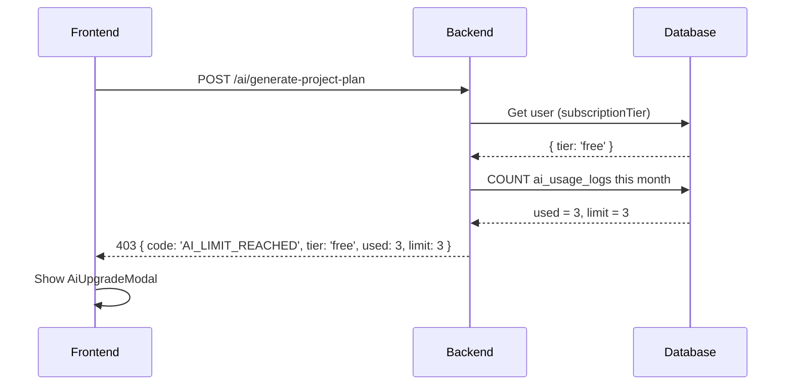
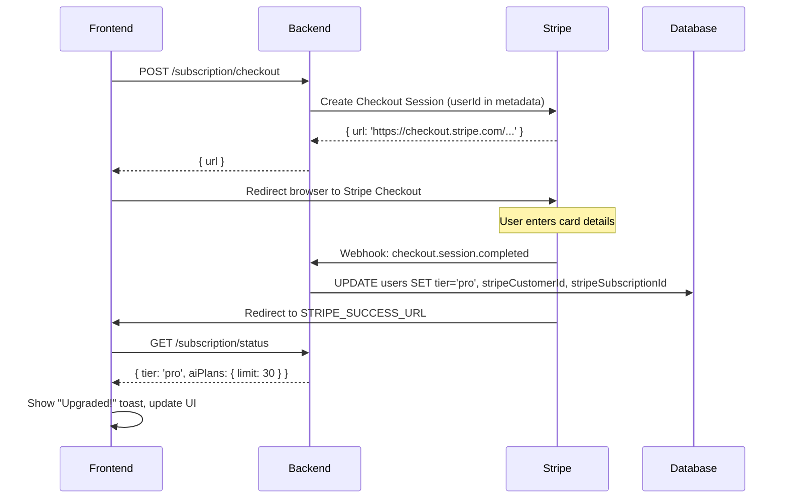
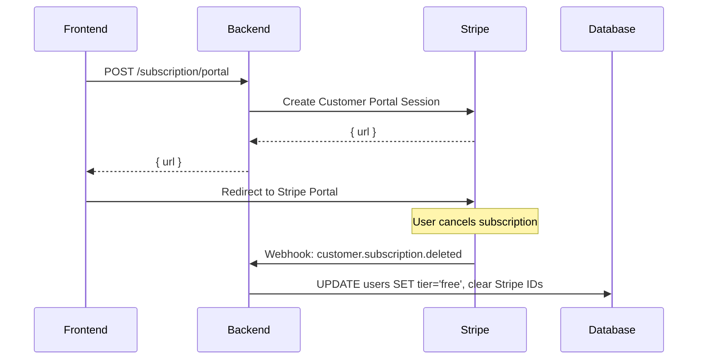

# AI Subscription Model — Implementation Plan (v2)

## Decisions Confirmed

| Question | Answer |
|---|---|
| Free tier limit | **3 AI plans/month** (resets monthly) |
| Pro tier limit | **30 AI plans/month** |
| Payment | **Real Stripe integration** (Checkout + Webhooks) |
| Description generator | **Infrastructure only** — both task & project form, no AI call yet; gating logic in place so enabling later is trivial |

---

## Background

Orchest already has a working AI project planning flow (via `/ai/generate-project-plan`) and a basic monthly usage counter (`AiUsageService` + `AiUsageLog` entity). Right now, the limit is just a flat number from the `.env` (`AI_USAGE_LIMIT=10`), applied to everyone equally with no subscription concept.

**What we need to build:**
- A **Free tier**: **3 AI plans/month** (resets monthly like the current counter).
- A **Pro tier** (subscribed via Stripe): **30 AI plans/month**.
- **Stripe Checkout + Webhooks**: real payment flow; subscription state is driven by Stripe events.
- **Description generator infrastructure**: gating logic + placeholder UI in both task and project forms, but no actual OpenAI call yet — flipping it on later only requires adding the AI call.
- Backend enforcement — 403 on limit hit, with structured error code for the frontend to show the upgrade modal.
- Frontend UI: `AiUpgradeModal`, Stripe redirect, subscription status in Settings/Billing.

---

## Tier Design

| Feature | Free (default) | Pro (subscribed) |
|---|---|---|
| AI Project Planning | **3/month** | **30/month** |
| AI Description Generation | **3/month** *(infra only, not active yet)* | **30/month** *(infra only)* |
| Price | Free | Real Stripe billing (e.g. $9/month) |

---

## Required `.env` Variables for Stripe

You need to add these to your `.env` file. Get them from your [Stripe Dashboard](https://dashboard.stripe.com):

```env
# Stripe
STRIPE_SECRET_KEY=sk_test_...        # From Stripe Dashboard > Developers > API Keys
STRIPE_WEBHOOK_SECRET=whsec_...      # From Stripe Dashboard > Webhooks > your endpoint > signing secret
STRIPE_PRO_PRICE_ID=price_...        # From Stripe Dashboard > Products > your Pro product > price ID
STRIPE_SUCCESS_URL=http://localhost:5173/settings?section=billing&success=1
STRIPE_CANCEL_URL=http://localhost:5173/settings?section=billing
```

**Setup steps in Stripe Dashboard:**
1. Create a Product called "Orchest Pro" with a recurring price of e.g. $9/month → copy the `price_...` ID.
2. Create a Webhook endpoint pointing to `https://your-backend/subscription/webhook` → select events: `checkout.session.completed`, `customer.subscription.deleted`, `customer.subscription.updated` → copy the `whsec_...` secret.
3. For local dev, use the [Stripe CLI](https://stripe.com/docs/stripe-cli): `stripe listen --forward-to localhost:3000/subscription/webhook`.

---

## Proposed Changes

---

### Component 1: Shared Package

#### [MODIFY] [ai-job.dto.ts](file:///d:/CS/ITI-MERN/Final-Proj/Orchest/shared/src/dtos/ai-job.dto.ts)
- Add `SubscriptionTier` enum: `'free' | 'pro'`
- Add `SubscriptionStatusResponse` interface:
  ```typescript
  interface SubscriptionStatusResponse {
    tier: 'free' | 'pro';
    stripeCustomerId?: string;
    stripeSubscriptionId?: string;
    subscriptionExpiresAt?: string;
    aiPlans: { used: number; limit: number; canUse: boolean; resetsAt: string; };
    aiDescriptions: { used: number; limit: number; canUse: boolean; resetsAt: string; }; // infra only
  }
  ```
- Add `AiLimitError` interface: `{ code: 'AI_LIMIT_REACHED'; tier: 'free' | 'pro'; feature: string; }`

#### [MODIFY] [index.ts](file:///d:/CS/ITI-MERN/Final-Proj/Orchest/shared/src/index.ts)
- Export new subscription DTOs, enum, and error types

---

### Component 2: Backend — User Entity

#### [MODIFY] [user.entity.ts](file:///d:/CS/ITI-MERN/Final-Proj/Orchest/app/backend/src/modules/users/entities/user.entity.ts)
Add five new columns to store Stripe + subscription data:
```typescript
@Column({ name: 'subscription_tier', type: 'varchar', default: 'free' })
subscriptionTier: 'free' | 'pro';

@Column({ name: 'stripe_customer_id', type: 'varchar', nullable: true, unique: true })
stripeCustomerId: string | null;

@Column({ name: 'stripe_subscription_id', type: 'varchar', nullable: true })
stripeSubscriptionId: string | null;

@Column({ name: 'subscription_expires_at', type: 'timestamp', nullable: true })
subscriptionExpiresAt: Date | null;

@Column({ name: 'subscribed_at', type: 'timestamp', nullable: true })
subscribedAt: Date | null;
```
TypeORM `synchronize: true` is already on in dev — these columns will be auto-created.

> [!NOTE]
> `stripeCustomerId` is used to look up the customer in Stripe for portal/cancel. `stripeSubscriptionId` identifies the active subscription. Both are set by the webhook handler, not by the frontend.

---

### Component 3: Backend — AI Usage Service (core logic change)

#### [MODIFY] [ai-usage.service.ts](file:///d:/CS/ITI-MERN/Final-Proj/Orchest/app/backend/src/modules/ai/services/ai-usage.service.ts)

Replace the flat env-based limit logic with subscription-aware logic. Both tiers are now **monthly** (same counting window, different limits):

```
checkLimit(userId, feature):
  1. Fetch user → get subscriptionTier
  2. Determine limit:
       - 'pro'  → limit = 30 (PRO_MONTHLY_LIMIT)
       - 'free' → limit = 3  (FREE_MONTHLY_LIMIT)
  3. Count AiUsageLog rows for this user+feature THIS MONTH
  4. canUse = used < limit
  5. Return { used, limit, canUse, tier, resetsAt }
```

New public method `getSubscriptionStatus(userId): SubscriptionStatusResponse` — returns full status for both features (`project_planning` and `description_generation`), used by the frontend subscription panel.

---

### Component 4: Backend — AI Controller

#### [MODIFY] [ai.controller.ts](file:///d:/CS/ITI-MERN/Final-Proj/Orchest/app/backend/src/modules/ai/ai.controller.ts)

- `GET /ai/usage-limit` → update to return tier-aware data (keep for backward compat).
- `GET /ai/subscription-status` → **NEW**: returns full `SubscriptionStatusResponse` for both features.
- `POST /ai/generate-description` → **NEW (infra/stub)**: accepts `{ context: string; type: 'task' | 'project' }`. Currently returns `501 Not Implemented` but **checks the limit first** and returns `403 AI_LIMIT_REACHED` if over quota. This means the gating is live and the UI can show it — adding the real OpenAI call later is a one-liner.

In `startProjectPlanGeneration`: add hard limit check at the top. Return `403` with body `{ code: 'AI_LIMIT_REACHED', tier, used, limit }` when over quota.

---

### Component 5: Backend — Subscription Module (Stripe)

This is a new dedicated module to keep Stripe logic isolated from Users.

#### [NEW] `app/backend/src/modules/subscription/subscription.module.ts`
Imports `UsersModule`, provides `StripeService` and `SubscriptionService`.

#### [NEW] `app/backend/src/modules/subscription/stripe.service.ts`
Thin wrapper around the `stripe` npm package:
- `createCheckoutSession(userId, email)` — creates a Stripe Checkout Session for `STRIPE_PRO_PRICE_ID`, attaches `userId` in metadata. Returns `{ url }` to redirect the user.
- `createCustomerPortalSession(stripeCustomerId)` — opens the Stripe billing portal so the user can cancel/update card.
- `constructEvent(rawBody, sig)` — verifies webhook signature.

#### [NEW] `app/backend/src/modules/subscription/subscription.controller.ts`
- `POST /subscription/checkout` (JWT-guarded) — calls `createCheckoutSession`, returns redirect URL.
- `POST /subscription/portal` (JWT-guarded) — calls `createCustomerPortalSession`, returns portal URL.
- `POST /subscription/webhook` (**no JWT** — raw body, Stripe signature header) — handles events:
  - `checkout.session.completed` → set `subscriptionTier='pro'`, save `stripeCustomerId`, `stripeSubscriptionId`, `subscribedAt`, `subscriptionExpiresAt`.
  - `customer.subscription.deleted` → set `subscriptionTier='free'`, clear Stripe IDs.
  - `customer.subscription.updated` → update `subscriptionExpiresAt` if period changes.
- `GET /subscription/status` (JWT-guarded) — delegates to `AiUsageService.getSubscriptionStatus(userId)`.

#### [MODIFY] [users.service.ts](file:///d:/CS/ITI-MERN/Final-Proj/Orchest/app/backend/src/modules/users/users.service.ts)
Add `updateSubscription(userId, data)` — generic updater called by the webhook handler to set Stripe fields on the user row.

> [!NOTE]
> The webhook endpoint must be registered **with raw body parsing** (not JSON). NestJS needs a special setup for this — the plan includes the required `main.ts` tweak to pass raw body to the webhook route only.

#### Required npm install
```bash
npm install stripe -w @orchest/backend
```

---

### Component 6: Frontend — API layer

#### [MODIFY] [ai.api.ts](file:///d:/CS/ITI-MERN/Final-Proj/Orchest/app/frontend/src/api/ai.api.ts)
- Update `checkAiUsageLimit` to call `/ai/subscription-status` and return the full `SubscriptionStatusResponse`.
- Add `generateDescription(context, type)` — POST `/ai/generate-description` (currently returns 501 but gating is live).

#### [NEW] `app/frontend/src/api/subscription.api.ts`
- `startCheckout()` — POST `/subscription/checkout` → returns `{ url }` → `window.location.href = url` to redirect to Stripe.
- `openPortal()` — POST `/subscription/portal` → returns `{ url }` → redirect to Stripe portal (for cancel/update card).
- `getSubscriptionStatus()` — GET `/subscription/status` → returns `SubscriptionStatusResponse`.

#### [NEW] React Query hooks in `app/frontend/src/hooks/useSubscription.ts`
- `useSubscriptionStatus()` — `useQuery` wrapping `getSubscriptionStatus()`.
- `useStartCheckout()` — `useMutation` wrapping `startCheckout()`.
- `useOpenPortal()` — `useMutation` wrapping `openPortal()`.

---

### Component 7: Frontend — Upgrade Modal (reusable component)

#### [NEW] `app/frontend/src/components/ai/AiUpgradeModal.tsx`

A premium-looking modal shown when any AI feature returns `403 AI_LIMIT_REACHED`. Shows:
- Usage summary: "You've used 3/3 AI plans this month"
- Feature comparison table (Free vs Pro)
- **"Upgrade to Pro"** CTA button → calls `startCheckout()` → redirects to Stripe Checkout
- Small print: "Redirecting to secure Stripe payment"

Props: `open`, `onClose`, `feature: 'project_planning' | 'description_generation'`.

This is triggered from `CreateProjectWizard` and the description generator placeholder when the API returns `403`.

---

### Component 8: Frontend — AI Usage Indicator in Header

#### [MODIFY] [Header.tsx](file:///d:/CS/ITI-MERN/Final-Proj/Orchest/app/frontend/src/components/layout/Header/Header.tsx)

Add a small pill/badge:
- **Free user**: shows "AI: 2/3" in amber when at 2+/3, red + pulse when at 3/3 (limit reached). Clicking it opens `AiUpgradeModal`.
- **Pro user**: shows a ✨ "Pro" badge in purple. Clicking goes to Settings > Billing.

Data from `useSubscriptionStatus()` (cached by React Query, minimal fetches).

---

### Component 9: Frontend — AI Description Generator (Infrastructure Only)

#### [NEW] `app/frontend/src/components/ai/AiDescriptionGenerator.tsx`

A reusable component: a textarea with an "✨ Generate with AI" button. Props: `value`, `onChange`, `context`, `type: 'task' | 'project'`.

When clicked:
1. Calls `generateDescription(context, type)` → backend returns `501 Not Implemented` for now.
2. The frontend **intercepts the 501** and shows a friendly "Coming Soon" toast.
3. BUT if the user is already over quota, the backend returns `403 AI_LIMIT_REACHED` first, and the frontend shows `AiUpgradeModal` — **the gating is fully wired up**.

This means: when you later implement the actual AI call on the backend (one function call to OpenAI), the feature becomes fully functional with subscription enforcement already in place.

#### [MODIFY] Task creation/edit form
Add `<AiDescriptionGenerator>` next to the description textarea. No behavior change to the form itself.

#### [MODIFY] Project creation wizard (Step 3)
Add `<AiDescriptionGenerator>` next to the project description field.

---

### Component 10: Frontend — Settings / Billing Page (wire up real Stripe data)

#### [MODIFY] [Settings.tsx](file:///d:/CS/ITI-MERN/Final-Proj/Orchest/app/frontend/src/pages/Settings/Settings.tsx)

The `BillingSection` is currently 100% hardcoded mock. Replace with real data from `useSubscriptionStatus()`:

**Free user view:**
- Shows "Free Plan" badge
- Feature comparison table (Free vs Pro)
- "Upgrade to Pro — $9/month" button → calls `startCheckout()` → redirects to Stripe

**Pro user view:**
- Shows "Pro Plan ✓" badge with expiry date from `subscriptionExpiresAt`
- Usage counters from `useSubscriptionStatus()`
- "Manage Billing" button → calls `openPortal()` → redirects to Stripe Customer Portal (cancel, update card, download invoices)

**Stripe redirect handling:** On return from Stripe Checkout (`?success=1` in the URL), show a success toast and invalidate the subscription query.

The `AiSection` usage card also gets updated to use `useSubscriptionStatus()` instead of the old `useAiUsage()` hook.

---

## Data Flow Summary

### AI Limit Enforcement


### Stripe Checkout Flow


### Cancel Flow


---

## Verification Plan

### Manual Verification
1. **Free limit**: New user → generate AI plan 3 times → 4th attempt shows `AiUpgradeModal` with Stripe redirect button.
2. **Stripe checkout**: Click "Upgrade to Pro" → Stripe Checkout opens → complete payment (use Stripe test card `4242 4242 4242 4242`) → redirected back → Settings > Billing shows "Pro Plan".
3. **Pro limit**: Generate AI plans up to 30 this month — should work; 31st should show limit modal.
4. **Description generator (infra)**: Click "✨ Generate with AI" in task form → over-quota user sees `AiUpgradeModal`; under-quota user sees "Coming Soon" toast.
5. **Cancel**: Settings > Billing → "Manage Billing" → Stripe Portal → Cancel → redirected back → tier reverts to Free.
6. **Header indicator**: Free user at 2/3 shows amber badge; at 3/3 shows red pulsing badge.
7. **Webhook local test**: `stripe listen --forward-to localhost:3000/subscription/webhook` → complete checkout → verify DB row updates.
