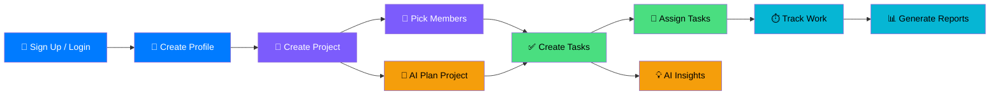
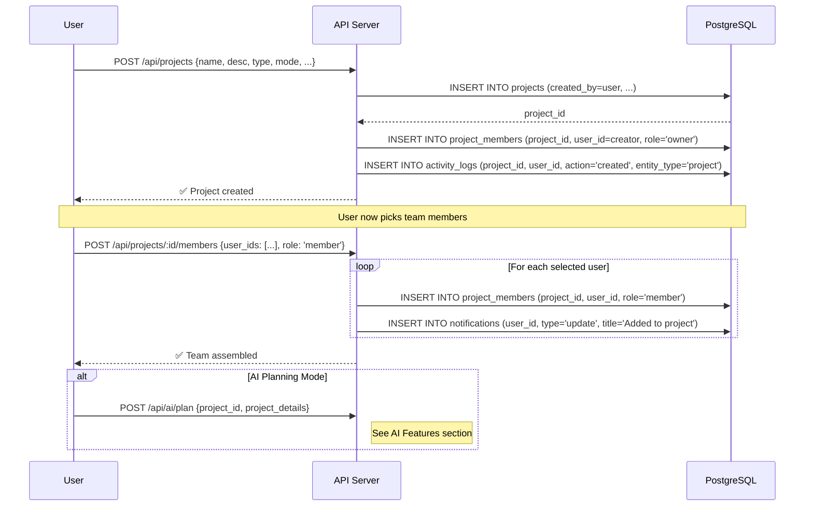
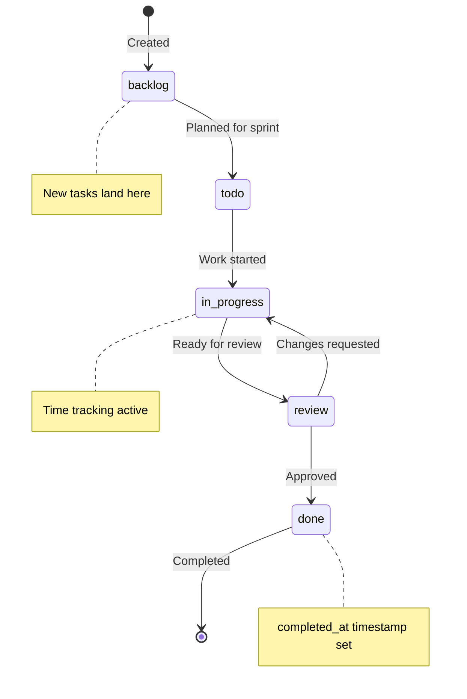
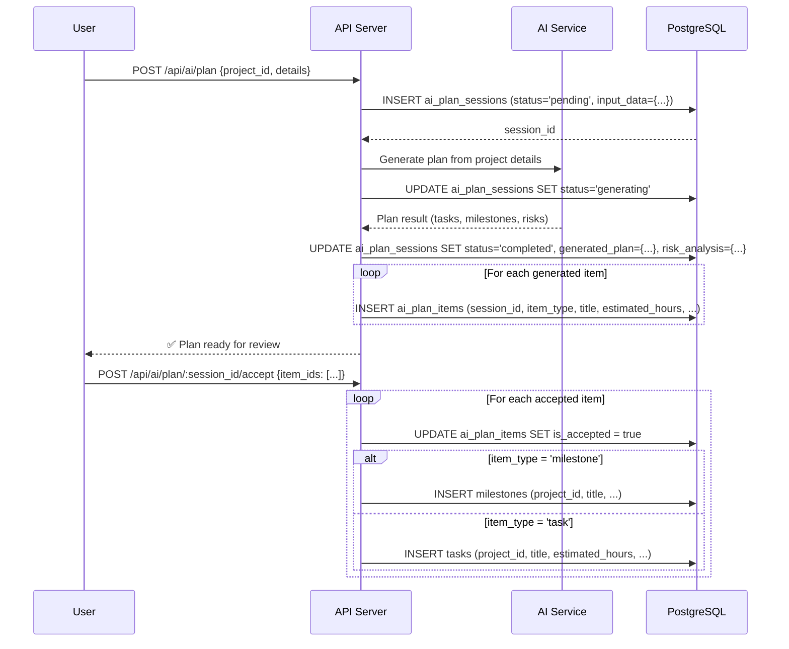
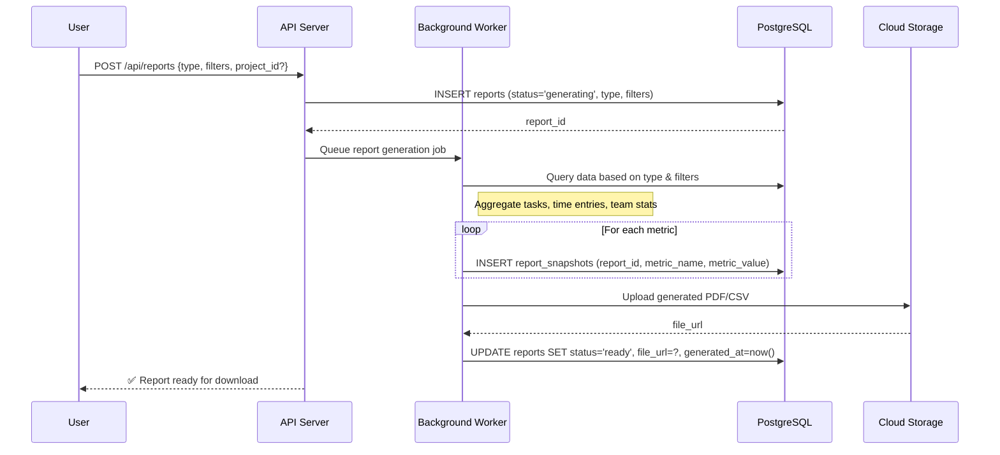
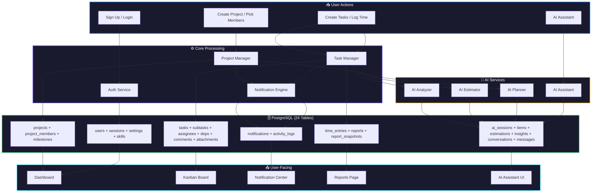

# 🔄 Orchest — Table Workflows & Data Flow Guide

> Complete workflow documentation for all **24 tables** — when data is created, how it flows, and how tables relate to each other.

---

## Table of Contents

1. [User Journey Overview](#user-journey-overview)
2. [Domain 1: Users & Auth](#domain-1-users--auth)
3. [Domain 2: Projects](#domain-2-projects)
4. [Domain 3: Tasks](#domain-3-tasks)
5. [Domain 4: AI Features](#domain-4-ai-features)
6. [Domain 5: Notifications & Collaboration](#domain-5-notifications--collaboration)
7. [Domain 6: Reports & Time Tracking](#domain-6-reports--time-tracking)
8. [Complete Data Flow Architecture](#complete-data-flow-architecture)

---

## User Journey Overview



---

## Domain 1: Users & Auth

### 1.1 `users`

> **The root entity.** Every other table traces back to a user.

| Aspect | Detail |
|--------|--------|
| **Created when** | User signs up (email/password, Google OAuth, or GitHub OAuth) |
| **Updated when** | User edits profile (name, avatar, role_title), changes availability, workload updates |
| **Deleted when** | User deletes account (cascades to all owned data) |

**Data flow:**
```
Sign Up Form → POST /api/auth/register → INSERT users
                                        → INSERT user_settings (defaults)
Google/GitHub OAuth → POST /api/auth/oauth → UPSERT users (auth_provider + auth_provider_id)
```

**Key relationships:**
- `users` → `user_sessions` (1:many) — tracks active logins
- `users` → `user_settings` (1:1) — preferences
- `users` → `user_skills` (1:many) — skill tags
- `users` → `projects` (1:many) — projects the user **created/owns**
- `users` → `project_members` (1:many) — projects the user **participates in** (= project team)
- `users` → `task_assignees` (1:many) — tasks assigned to user
- `users` → `comments` (1:many) — comments written by user
- `users` → `notifications` (1:many) — notifications received
- `users` → `time_entries` (1:many) — time logged
- `users` → `ai_conversations` (1:many) — AI chats initiated

---

### 1.2 `user_sessions`

> **Tracks active login sessions** across devices. Powers the "Active Sessions" panel in Settings.

| Aspect | Detail |
|--------|--------|
| **Created when** | User logs in from any device |
| **Updated when** | Session is invalidated (logout) → `is_active = false` |
| **Deleted when** | Expired sessions are cleaned up by a cron job |

**Data flow:**
```
Login → POST /api/auth/login → INSERT user_sessions (token_hash, device_info, ip)
                              → UPDATE users.last_login_at
Logout → POST /api/auth/logout → UPDATE user_sessions SET is_active = false
Settings > "Manage Sessions" → GET /api/auth/sessions → SELECT * FROM user_sessions WHERE user_id = ? AND is_active = true
```

**Relations:** `user_sessions.user_id` → `users.id`

---

### 1.3 `user_settings`

> **1:1 with users.** Stores preferences, notification toggles, security settings.

| Aspect | Detail |
|--------|--------|
| **Created when** | Automatically on user registration (with defaults) |
| **Updated when** | User changes theme, language, notification preferences, or enables 2FA |
| **Deleted when** | User account is deleted (CASCADE) |

**Data flow:**
```
Registration → INSERT user_settings (theme='dark', language='en', email_notifications=true, ...)
Settings Page → PUT /api/users/settings → UPDATE user_settings
Theme Toggle → PATCH /api/users/settings/theme → UPDATE user_settings.theme
```

**Relations:** `user_settings.user_id` → `users.id` (UNIQUE — one row per user)

---

### 1.4 `user_skills`

> **Tags representing a user's technical skills.** Displayed on team member cards, used for smart assignment.

| Aspect | Detail |
|--------|--------|
| **Created when** | User adds skills to profile, or admin adds skills when creating a team member |
| **Updated when** | N/A (skills are added/removed, not edited) |
| **Deleted when** | User removes a skill from profile |

**Data flow:**
```
Profile Edit → POST /api/users/:id/skills → INSERT user_skills (user_id, 'React')
Project Page → GET /api/projects/:id/members → JOIN user_skills to show skill badges
AI Planner → SELECT user_skills WHERE user_id IN (project members) → used for smart task assignment
```

**Relations:** `user_skills.user_id` → `users.id`

---

## Domain 2: Projects

### 2.1 `projects`

> **The central entity for work management.** Created by a user, who then picks members to form the project team.

| Aspect | Detail |
|--------|--------|
| **Created when** | User fills out the Create Project form (name, description, dates, priority, mode) |
| **Updated when** | Status changes, progress updates, settings modified |
| **Deleted when** | Project owner deletes from Settings tab (Danger Zone) |

**Data flow:**


**Key relationships:**
- `projects.created_by` → `users.id` — project **owner**
- `projects` → `project_members` (1:many) — **the project's team**
- `projects` → `milestones` (1:many) — phased goals
- `projects` → `tasks` (1:many) — all work items
- `projects` → `activity_logs` (1:many) — audit trail
- `projects` → `reports` (1:many) — generated reports
- `projects` → `ai_plan_sessions` (1:many) — AI planning history
- `projects` → `time_entries` (1:many) — all time logged

---

### 2.2 `project_members`

> **The project's team.** When a user creates a project and picks members, each selected user becomes a row here. This IS the team — no separate teams table.

| Aspect | Detail |
|--------|--------|
| **Created when** | Project created (owner auto-added as `owner`), then user picks additional members |
| **Updated when** | Role changes (member ↔ owner) |
| **Deleted when** | Member removed from project |

**Workflow:**
```
1. User creates project → auto-INSERT project_members (role='owner') for creator
2. User picks members from user list → INSERT project_members for each selected user
3. Members now appear on the project's Team tab
4. Members can be assigned to tasks within this project
```

**Roles & permissions:**

| Role | View | Edit Tasks | Manage Members | Delete Project |
|------|------|-----------|----------------|---------------|
| `owner` | ✅ | ✅ | ✅ | ✅ |
| `member` | ✅ | ✅ | ❌ | ❌ |

**Data flow:**
```
Pick members:   POST /api/projects/:id/members → INSERT project_members for each user
Remove member:  DELETE FROM project_members WHERE project_id = ? AND user_id = ?
Get team:       SELECT u.*, pm.role FROM users u JOIN project_members pm ON u.id = pm.user_id WHERE pm.project_id = ?
Assignable:     Only project_members can be assigned to tasks in that project
```

**Constraint:** `UNIQUE (project_id, user_id)`

---

### 2.3 `milestones`

> **Phased goals within a project** (e.g., Phase 1: Foundation, Phase 2: Core Features). Tasks are grouped under milestones.

| Aspect | Detail |
|--------|--------|
| **Created when** | User creates manually, or AI planner generates them |
| **Updated when** | Status changes (upcoming → in-progress → completed), progress recalculated |
| **Deleted when** | User removes milestone (tasks unlinked, not deleted) |

**Data flow:**
```
Auto-progress calculation:
  milestone.progress = (tasks WHERE milestone_id = ? AND status = 'done').count 
                       / (tasks WHERE milestone_id = ?).count * 100

When all tasks under a milestone are 'done':
  UPDATE milestones SET status = 'completed', progress = 100
```

**Relations:** 
- `milestones.project_id` → `projects.id`
- `milestones` → `tasks` (1:many) — tasks grouped under this phase

---

## Domain 3: Tasks

### 3.1 `tasks`

> **The core work unit.** Displayed on the Kanban board. Moves through: `backlog → todo → in-progress → review → done`

| Aspect | Detail |
|--------|--------|
| **Created when** | User creates task manually, or AI planner generates tasks |
| **Updated when** | Status drag on Kanban, priority change, description edit, assignee change |
| **Deleted when** | User or project owner deletes task |

**Full task lifecycle:**



**Data flow on status change:**
```
Kanban drag (in-progress → review):
  → UPDATE tasks SET status = 'review', updated_at = now()
  → INSERT activity_logs (action='updated', entity_type='task', description='moved to Review')
  → INSERT notifications for assignees (type='task', title='Task moved to Review')
  → Recalculate milestone.progress
  → Recalculate project.progress

Kanban drag (review → done):
  → UPDATE tasks SET status = 'done', completed_at = now(), actual_hours = calculated
  → INSERT activity_logs (action='completed')
  → INSERT notifications for project owner
  → UPDATE milestones progress
  → UPDATE projects progress
```

**Key relationships:**
- `tasks.project_id` → `projects.id` — belongs to project
- `tasks.milestone_id` → `milestones.id` — **nullable** (unphased tasks)
- `tasks.created_by` → `users.id` — who created it
- `tasks` → `subtasks` (1:many) — checklist items
- `tasks` → `task_assignees` (1:many) — who's working on it
- `tasks` → `task_dependencies` (1:many) — blocking/prerequisite graph
- `tasks` → `comments` (1:many) — discussion thread
- `tasks` → `attachments` (1:many) — files
- `tasks` → `time_entries` (1:many) — logged hours
- `tasks` → `ai_task_insights` (1:many) — AI analysis

---

### 3.2 `subtasks`

> **Checklist items within a task** (e.g., "Setup WebSocket server", "Add error handling").

| Aspect | Detail |
|--------|--------|
| **Created when** | User adds a checklist item on the task detail page |
| **Updated when** | Checkbox toggled (`is_completed` flipped), title edited, reordered |
| **Deleted when** | User removes the subtask |

**Data flow:**
```
Toggle checkbox:
  → UPDATE subtasks SET is_completed = true
  → Task progress = completed_subtasks / total_subtasks * 100
  → If all subtasks completed → suggest moving task to 'review'
```

**Relations:** `subtasks.task_id` → `tasks.id`

---

### 3.3 `task_assignees`

> **Junction table: User ↔ Task.** Multiple users can be assigned to one task. One is marked `is_primary`.

| Aspect | Detail |
|--------|--------|
| **Created when** | Task is assigned to a user (drag to member, or select in task detail) |
| **Updated when** | Primary assignee changes |
| **Deleted when** | User is unassigned from task |

**Data flow:**
```
Assign user:
  → INSERT task_assignees (task_id, user_id, is_primary)
  → INSERT notifications (user_id, type='task', title='You were assigned to...')
  → INSERT activity_logs (action='assigned')
  → UPDATE users.workload_percent (recalculate based on active task count)
```

**Constraint:** `UNIQUE (task_id, user_id)`

---

### 3.4 `task_dependencies`

> **Defines blocking relationships between tasks.** Prevents starting a task until prerequisites are done.

| Aspect | Detail |
|--------|--------|
| **Created when** | User links a dependency in the task detail sidebar |
| **Updated when** | Dependency type changes (blocks → related) |
| **Deleted when** | User removes the dependency link |

**Types:**
| Type | Meaning |
|------|---------|
| `blocks` | Task B cannot start until Task A is done |
| `requires` | Task B needs Task A but can start in parallel |
| `related` | Informational link, no blocking |

**Data flow:**
```
When a blocking task (A) moves to 'done':
  → Check all tasks where depends_on_task_id = A.id AND type = 'blocks'
  → If all blockers are done → INSERT notification (type='task', 'Task X is now unblocked')
  → UI shows task as ready to start
```

**Constraint:** `CHECK (task_id != depends_on_task_id)` — no self-dependency

---

### 3.5 `comments`

> **Threaded discussions on tasks.** Supports replies via `parent_comment_id` self-reference.

| Aspect | Detail |
|--------|--------|
| **Created when** | User posts a comment on a task |
| **Updated when** | User edits comment (`is_edited = true`) |
| **Deleted when** | User or admin deletes comment |

**Data flow:**
```
Post comment:
  → INSERT comments (task_id, user_id, content)
  → Parse content for @mentions → INSERT notifications (type='mention') for each mentioned user
  → INSERT notifications (type='comment') for all task assignees (except commenter)
  → INSERT activity_logs (action='commented')
  → UPDATE tasks.updated_at

Reply to comment:
  → INSERT comments (task_id, user_id, content, parent_comment_id = original_comment.id)
```

**Relations:**
- `comments.task_id` → `tasks.id`
- `comments.user_id` → `users.id`
- `comments.parent_comment_id` → `comments.id` (self-reference for threads)

---

### 3.6 `attachments`

> **Files attached to tasks** (PDFs, images, docs). Stored in cloud storage, URL saved in DB.

| Aspect | Detail |
|--------|--------|
| **Created when** | User uploads a file on the task detail page |
| **Updated when** | N/A (attachments are immutable — delete and re-upload) |
| **Deleted when** | User removes attachment |

**Data flow:**
```
Upload:
  → Upload file to cloud storage (S3/GCS) → get file_url
  → INSERT attachments (task_id, uploaded_by, file_name, file_url, file_type, file_size_bytes)
  → INSERT activity_logs (action='updated', description='added attachment: spec.pdf')
```

**Relations:**
- `attachments.task_id` → `tasks.id`
- `attachments.uploaded_by` → `users.id`

---

## Domain 4: AI Features

### 4.1 `ai_plan_sessions`

> **Records each AI planning run for a project.** Stores the input sent to AI and the generated output.

| Aspect | Detail |
|--------|--------|
| **Created when** | User clicks "Continue to AI Planning" with project details |
| **Updated when** | AI generation completes → status changes, `generated_plan` populated |
| **Deleted when** | Rarely — kept as history |

**Data flow:**



**Relations:**
- `ai_plan_sessions.project_id` → `projects.id`
- `ai_plan_sessions.initiated_by` → `users.id`
- `ai_plan_sessions` → `ai_plan_items` (1:many)

---

### 4.2 `ai_plan_items`

> **Individual items generated by an AI planning session** — tasks, milestones, or dependency suggestions.

| Aspect | Detail |
|--------|--------|
| **Created when** | AI plan session completes → items parsed from AI output |
| **Updated when** | User accepts/rejects item (`is_accepted` toggled) |
| **Deleted when** | Session is deleted (CASCADE) |

**Data flow:**
```
Accept item:
  → UPDATE ai_plan_items SET is_accepted = true
  → INSERT tasks OR INSERT milestones (depending on item_type)
  → Link created entity back to the project

Reject item:
  → UPDATE ai_plan_items SET is_accepted = false
  → No further action
```

**Relations:** `ai_plan_items.session_id` → `ai_plan_sessions.id`

---

### 4.3 `ai_estimations`

> **AI-generated time and complexity estimates** for tasks. Powers the AI Time Estimation Tool page.

| Aspect | Detail |
|--------|--------|
| **Created when** | User submits a task description to the AI estimator |
| **Updated when** | N/A (estimations are immutable snapshots) |
| **Deleted when** | Rarely — kept for historical accuracy tracking |

**Data flow:**
```
AI Estimation Tool:
  → User enters task description
  → POST /api/ai/estimate {description, project_id?}
  → AI analyzes → returns hours, confidence, complexity, breakdown
  → INSERT ai_estimations (task_description, estimated_hours, confidence_percent, ...)
  → If linked to existing task: UPDATE tasks.estimated_hours = ai_estimations.estimated_hours
```

**Relations:**
- `ai_estimations.project_id` → `projects.id` (nullable)
- `ai_estimations.task_id` → `tasks.id` (nullable — can estimate before task exists)
- `ai_estimations.created_by` → `users.id`

---

### 4.4 `ai_task_insights`

> **Per-task AI analysis** — suggestions, risk warnings, predictions shown on the task detail page.

| Aspect | Detail |
|--------|--------|
| **Created when** | Background AI analysis runs on tasks (cron or on-demand) |
| **Updated when** | User dismisses insight (`is_dismissed = true`) |
| **Deleted when** | Task is deleted (CASCADE) |

**Data flow:**
```
Background AI job (daily or on task update):
  → SELECT tasks WHERE status IN ('in-progress', 'review') AND updated_at > last_analysis
  → For each task: analyze progress, time spent vs estimated, similar task history
  → INSERT ai_task_insights (task_id, insight_type, message, severity)

Examples:
  - "Task is 50% complete and on track" (type='prediction', severity='info')
  - "Similar tasks took 14h average — you're at 8h" (type='suggestion', severity='info')
  - "Deadline in 2 days, only 30% done" (type='risk', severity='critical')
```

**Relations:** `ai_task_insights.task_id` → `tasks.id`

---

### 4.5 `ai_conversations`

> **Chat sessions with the Global AI Assistant.** Can be general or contextual (attached to a project/task).

| Aspect | Detail |
|--------|--------|
| **Created when** | User opens AI Assistant and starts a new conversation |
| **Updated when** | New messages are added → `updated_at` refreshed |
| **Deleted when** | User deletes conversation history |

**Data flow:**
```
Open AI Assistant:
  → POST /api/ai/conversations {context_type: 'project', context_id: project_id}
  → INSERT ai_conversations (user_id, context_type, context_id)

Context types:
  - 'general' → no specific context, general Q&A
  - 'project' → context_id = project.id, AI has project data in context
  - 'task'    → context_id = task.id, AI has task details in context
```

**Relations:**
- `ai_conversations.user_id` → `users.id`
- `ai_conversations.context_id` → polymorphic (project or task based on `context_type`)

---

### 4.6 `ai_messages`

> **Individual messages in an AI conversation.** Stores both user prompts and AI responses.

| Aspect | Detail |
|--------|--------|
| **Created when** | User sends a message or AI responds |
| **Updated when** | N/A (messages are immutable) |
| **Deleted when** | Conversation is deleted (CASCADE) |

**Data flow:**
```
User sends message:
  → INSERT ai_messages (conversation_id, role='user', content='How can I optimize this task?')
  → Send to AI with conversation history + context data
  → AI responds
  → INSERT ai_messages (conversation_id, role='assistant', content='Based on the task...', metadata={tokens, model, latency})
  → UPDATE ai_conversations.updated_at
```

**Relations:** `ai_messages.conversation_id` → `ai_conversations.id`

---

## Domain 5: Notifications & Collaboration

### 5.1 `notifications`

> **User-facing alerts.** Displayed in the Notification Center. Supports polymorphic references to any entity.

| Aspect | Detail |
|--------|--------|
| **Created when** | System events trigger notifications (see triggers below) |
| **Updated when** | User reads (`is_read = true`) or archives (`is_archived = true`) |
| **Deleted when** | User deletes notification |

**Triggers that create notifications:**

| Trigger Event | `type` | `reference_type` | Who Receives |
|---------------|--------|-------------------|-------------|
| Task assigned to user | `task` | `task` | Assignee |
| Task status changed | `task` | `task` | All assignees |
| Task completed | `task` | `task` | Project owner |
| New comment on task | `comment` | `comment` | Task assignees |
| @mentioned in comment | `mention` | `comment` | Mentioned user |
| Milestone reached | `update` | `milestone` | Project members |
| Deadline approaching (3 days) | `alert` | `task` | Assignees |
| Added to project | `update` | `project` | Added user |

**Data flow:**
```
Mark as read:         UPDATE notifications SET is_read = true WHERE id = ?
Mark all as read:     UPDATE notifications SET is_read = true WHERE user_id = ? AND is_read = false
Archive:              UPDATE notifications SET is_archived = true WHERE id = ?
Delete:               DELETE FROM notifications WHERE id = ?
Unread count:         SELECT COUNT(*) FROM notifications WHERE user_id = ? AND is_read = false
Filter by mentions:   SELECT * FROM notifications WHERE user_id = ? AND type = 'mention'
```

**Relations:**
- `notifications.user_id` → `users.id`
- `notifications.reference_id` → polymorphic (resolves via `reference_type`)

---

### 5.2 `activity_logs`

> **Audit trail and activity feed.** Powers the "Activity Feed" sidebar and project history.

| Aspect | Detail |
|--------|--------|
| **Created when** | Any significant action happens in the system |
| **Updated when** | Never (immutable audit log) |
| **Deleted when** | Data retention policy cleanup (e.g., > 1 year) |

**What generates activity logs:**

| Action | `entity_type` | `action` | Example `description` |
|--------|--------------|----------|----------------------|
| Create task | `task` | `created` | "Created task 'Implement WebSocket'" |
| Update task status | `task` | `updated` | "Moved 'API Integration' to Review" |
| Complete task | `task` | `completed` | "Completed 'API Integration'" |
| Post comment | `comment` | `commented` | "Commented on 'Database Schema'" |
| Assign task | `task` | `assigned` | "Assigned 'UI Design' to Sarah" |
| Create project | `project` | `created` | "Created project 'Orion'" |
| Complete milestone | `milestone` | `completed` | "Phase 1: Foundation completed" |
| Delete task | `task` | `deleted` | "Deleted task 'Old migration'" |

**Data flow:**
```
Activity Feed:     SELECT * FROM activity_logs WHERE project_id = ? ORDER BY created_at DESC LIMIT 20
User activity:     SELECT * FROM activity_logs WHERE user_id = ? ORDER BY created_at DESC
Global feed:       SELECT * FROM activity_logs WHERE project_id IN (user's projects) ORDER BY created_at DESC
```

**Relations:**
- `activity_logs.project_id` → `projects.id` (nullable for non-project actions)
- `activity_logs.user_id` → `users.id`

---

## Domain 6: Reports & Time Tracking

### 6.1 `time_entries`

> **Logged work hours.** Supports both team time tracking and freelancer billing (with hourly rate).

| Aspect | Detail |
|--------|--------|
| **Created when** | User logs time manually, or timer stops |
| **Updated when** | User edits duration or description |
| **Deleted when** | User removes a time entry |

**Data flow:**
```
Log time:
  → INSERT time_entries (task_id, user_id, project_id, duration_minutes, entry_date)
  → UPDATE tasks.actual_hours += duration_minutes / 60
  → Freelancer mode: INSERT with hourly_rate → used for revenue calculation

Dashboard stats:
  Hours this month:  SELECT SUM(duration_minutes)/60 FROM time_entries WHERE user_id = ? AND entry_date >= month_start
  Revenue:           SELECT SUM(duration_minutes/60 * hourly_rate) FROM time_entries WHERE user_id = ?
  Project time:      SELECT SUM(duration_minutes) FROM time_entries WHERE project_id = ? GROUP BY user_id
```

**Relations:**
- `time_entries.task_id` → `tasks.id` (nullable — can log time to project without specific task)
- `time_entries.user_id` → `users.id`
- `time_entries.project_id` → `projects.id`

---

### 6.2 `reports`

> **Generated analytics reports.** Stored as files (PDF/CSV) with metadata in DB.

| Aspect | Detail |
|--------|--------|
| **Created when** | User clicks "Generate Report" on the Reports page |
| **Updated when** | Status changes: `generating → ready` (or `failed`) |
| **Deleted when** | User deletes old reports |

**Data flow:**


**Report types & data sources:**

| Report Type | Data Queried |
|-------------|-------------|
| `performance` | tasks (status counts, velocity), time_entries (hours), milestones (progress) |
| `team` | users + task_assignees (per-member stats), time_entries (hours per user) |
| `projects` | projects (status, progress), tasks (distribution), milestones |
| `executive` | All of the above + ai_estimations (accuracy) |

**Relations:**
- `reports.project_id` → `projects.id` (nullable for cross-project reports)
- `reports.generated_by` → `users.id`

---

### 6.3 `report_snapshots`

> **Point-in-time metric data captured when a report is generated.** Preserves historical values.

| Aspect | Detail |
|--------|--------|
| **Created when** | Report generation completes — metrics are snapshotted |
| **Updated when** | Never (immutable snapshots) |
| **Deleted when** | Report is deleted (CASCADE) |

**Example snapshots for a "Performance" report:**

| `metric_name` | `metric_value` | `metric_unit` |
|---------------|---------------|---------------|
| `tasks_completed` | 24 | `count` |
| `tasks_in_progress` | 8 | `count` |
| `tasks_blocked` | 3 | `count` |
| `sprint_velocity` | 85 | `percent` |
| `avg_cycle_time` | 2.4 | `days` |
| `team_utilization` | 78 | `percent` |

**Relations:** `report_snapshots.report_id` → `reports.id`

---

## Complete Data Flow Architecture



---

> [!TIP]
> **Reading order:** Start with `users` → `projects` → `project_members` → `tasks`. These 4 tables form the backbone. Everything else (AI, notifications, reports, time tracking) **reads from and writes to** these core tables.

> [!IMPORTANT]
> **Every write operation** (INSERT/UPDATE/DELETE) on core tables should trigger:
> 1. An `activity_logs` entry (audit trail)
> 2. Relevant `notifications` for affected users
> 3. Progress recalculation on parent entities (task → milestone → project)
